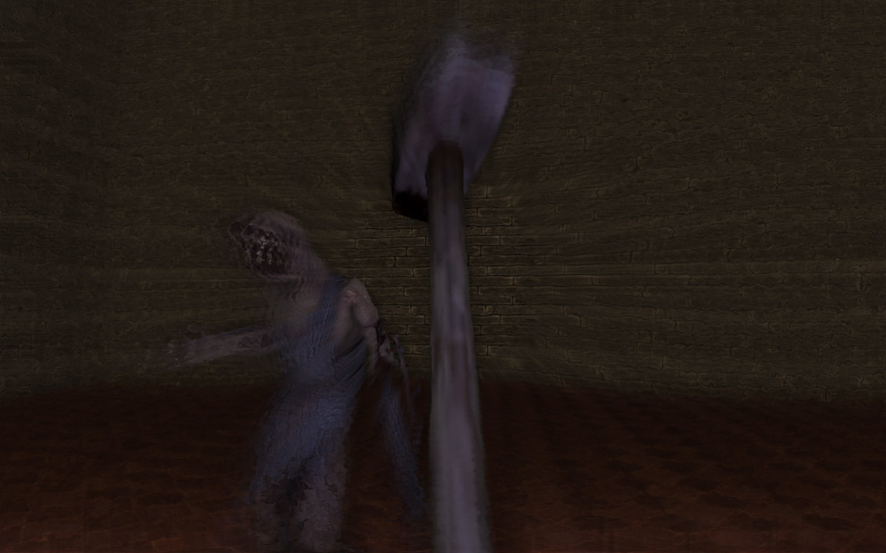

# Amnesia-Combat

Test environment for the implementation of combat in the game [Amnesia: The Dark Descent](https://en.wikipedia.org/wiki/Amnesia:_The_Dark_Descent).  
This feature is already used in the following mode → [The Cursed Knight](https://www.moddb.com/mods/the-cursed-knight).

It is about detecting a collision between a weapon and a monster and evaluating whether the weapon has made a sufficiently strong blow.

