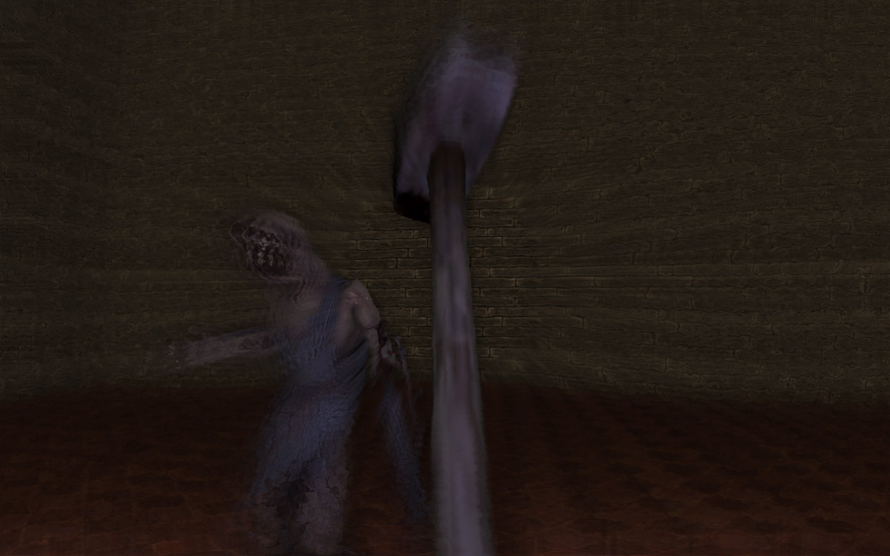

# Amnesia-Combat

Test environment for the implementation of combat in the game [Amnesia: The Dark Descent](https://en.wikipedia.org/wiki/Amnesia:_The_Dark_Descent).  
This feature is already used in the following mode → [The Cursed Knight](https://www.moddb.com/mods/the-cursed-knight).

The program solves the detection of a weapon collision with a monster and evaluation of whether a sufficiently strong strike was made.  

## Requirements
Amnesia: The Dark Descent version 1.3.1

## Installation  
Just clone the repository to the following path. `./Amnesia The Dark Descent/custom_stories`  
After cloning the repository to the path, you should see it in the custom story game menu.
